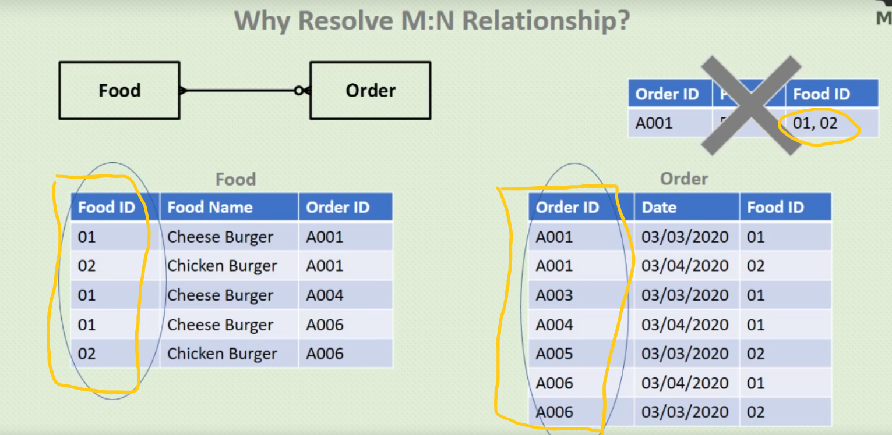

# Database Modelling Udemy Course

> ## Learning Objectives 
## Understand...
* Database and Relational Database
* Data Modelling 
* Entitiy Relationship Diagram (ERD)
* Design Database
* Analyze business/organization to model data requirement

---
>## Course Outline
* database ? Relation Database ?
* tables?
* Anomalies (Insert, Update, Delete)
* Case Study Analysis (real life scenario analysis)
* Database Development Steps (Conceptual, Logical, Physical)
* Entity Relationship Deagram (ERD)
* Dependency (Functional, Partial, Transative)
* Normalization (UNF, 1NF, 2NF, 3NF)

---
>## Acquired Skills after course completion
* Data Modelling
* Relational Database Design

---

># __What is a Database ?__

* Where we keep data
* Keeping data without planning is problematic
* Need a specific structure to organize data - TABLES

>## __Students Table__
| StudentID | Name          |      Address     |
| ----      | -----         |      -------     |
| 1         | JohnDoe       |      Hamilton    |
| 2         | MaryJane      |      Mississauga |
| 3         | JohnDoe       |      Hamilton    |
| 4         | MaryJane      |      Mississauga |

> Vertical section = column = __*Domain*__ bcoz only one type of data exists in this section

> Horizontal section = row =  __*Record*__ bcoz data in this section belongs to only one student 

* Table is a collection of rows and columns or a collection of records and domains
* Database is a collection of tables

> Difference between Relational Database and a Database ?

* Database
    *  A random collection of tables
* Relationanl Database
    *  Not random collection. The tables have a relation or a connection in between each other

> Why Relational Database 

 ##### Table 1 - Admissions Department
| ID |  Name    | Address   |
| -- |  ----    |  -------  |
| 1  |  John    | New York California  |
| 2  |  Mary    | New Jsy   |
| 3  |  Rich    | Toronto   |
| 4  |  Jake    | Greenland |

* ## In the tables 1 and 2
    * John has two different addresses.  John can have two different databases
    * Primary Address and Secondary Address
    * However - The address is different in two different tables
    * This implies that this is not an example of a relational database
    * Something is clearly wrong with this design
    * Lets say John used to live in California at first but then moved to CANADA, after some years we query the database, how can I know which one is the correct address when a record shows two different addresses. This creates a problem
    * This is one reason why we make a relational database
##### Table 2- Accounts Department
| ID |  Name    | Address   |       Fees    |   Paid    | Due   |
| -- |  ----    |  -------  |       ------- | -------   | ------|
| 1  |  John    | New York Canada|  1000    |   300     |  700  |
| 2  |  Mary    | New Jsy   |       1500    |   500     |  1000 |
| 3  |  Rich    | Toronto   |       1200    |   1000    |   200 |
| 4  |  Jake    | Greenland |       1000    |   400     |   600 |

>  NOW here is how a relational database would look like. This is not a good database design however, this shows how a duplicate address problem that we saw above can be rectified

##### Table 1 - Admissions Department
| ID |  Name    | Address   |
| -- |  ----    |  -------  |
| 1  |  John    | New York California  |
| 2  |  Mary    | New Jsy   |
| 3  |  Rich    | Toronto   |
| 4  |  Jake    | Greenland |

* ## In the tables 1 and 2
    * Now address is just in one table, Addmissions Table has to use the primary key of Accounts Department to inquire a students address. 
    * There is only one table that has address. Therefore, there is no redundancy
    * This design still has problems that we will fix as we go further. 
    * For the meantime, this  solves the mistaching problem of the address
    * In both tables, every record in both tables is linked to each other through an ID. Both records in two tables with common ID are linked to each otehr through the ID. 
 ##### Table 2- Accounts Department
| ID |  Fees    |   Paid    | Due   |
| -- |  ------- | -------   | ------|
| 1  |  1000    |   300     |  700  |
| 2  |  1500    |   500     |  1000 |
| 3  |  1200    |   1000    |   200 |
| 4  |  1000    |   400     |   600 |

> ### Somehting like this...

> Every row in a database musy have a unique identifier
* This has to be unique to avoid the same problem we saw above *Redudancy* is *bad* coz its leads to confusion 😋😋😋 . 
 * Names cannot be used as a unique identifier as people can have unique names
 * We cannot ask people to change their names coz we need to add them to a database lol. That would suck 😢 😢 😢

 > Primary key 🔑 : it is a unique value  and it will never appear twice
 
 > Foreign key 🔑 :  what the hell is this now ? lol .... Lets find our bro 😎
 * To find out what foreign key, lets look at the table again...

 ##### Table 1 - Admissions Department
| 🔑ID     |  Name    | Address   |
| --     |  ----    |  -------  |
|   1  |  John    | New York California  |
|   2  |  Mary    | New Jsy   |
|   3  |  Rich    | Toronto   |
|   4  |  Jake    | Greenland |
 
 ##### Table 2- Accounts Department
| 🔑ID     |   Paid |
| ----   | -------|   
|   1   |   300  | 
|   2   |   500  |  
|   3   |   1000 |   
|   4   |   400  |   

*  In the tables 1 and 2
    * Both tables are connected with a unique identifier ( Primary Key 🔑)
    * HOWEVER, the tables are still not relational... 😢
    * WHY? bcoz of two main problems 
        * If someone else also paid an amount of 💰 300 dollars, How can we check from the "paid" column which student paid 300 dollars. basically, 300 can be repeated among different students. It is not unique. Just by looking at the paid amount, we cannot determine which amount 300 💰 goes to which person
        * What if we need an invoice number, there is no way to add that field
        * If a student 👶 wants to add another payment, (multiple payments), how will we keep track, 9n the current database, we will have to add another record with same primary key 🔑 to add another payment. 
        * BUT this violates the rule of no redudancy  . In a good database design, the primary key should only belong to only one record. No duplication 

> Solution - Foreign Key 🔑

 
 ##### Table 1- Accounts Department
| 🔑Transaction ID       |   Paid |       StudentID   |
|           ----       | -------|       ----------  |
|     001            |   300  |       1234        |
|     002            |   500  |       3245        |
|     003            |   1000 |       7345        |
|     004            |   400  |       1234        |
|     005            |   400  |       2453        |
|     006            |   400  |       3245        |
|     007            |   400  |       1234        |
|     008            |   400  |       7345        |

 ##### Table 2 - Admissions Department
| 🔑Student ID            |  Name    | Address   |
|        --             |  ----    |  -------  |
|    1234       |  John    | New York California  |
|    3245       |  Mary    | New Jsy   |
|    2453       |  Rich    | Toronto   |
|    7345       |  Jake    | Greenland |

* Now each primary key of a student is being used as a 🔑primary key in the Student Table and as a 🔑foreign key linking to its transaction in the Accounts table.
* This way, Accounts table can have multiple records for students with multiple transactions / payments
* All we have to do is repeat the Student ID associated with the transaction HOWEVER, every transaction/payment is different even if belongs to 1 student 👶
* This ensures all transactions can be tracked with a unique identifier ( 🔑 ) and not repeat the Student ID again and again as it is being used as a 🔑 primary key in its own table 

> # Meta Data
* It is the data about data
* What kind of data we store in a column
* Let's say in the below table, what kind of data do we store in each column or domain? 
* Its either numbers or characters etc
* Datatype is metadata. Digits, Characters or Alpha Numerics (both chars and nums)

| 🔑Student ID            |  Name    | Address   |
|        --             |  ----    |  -------  |
|    1234       |  John    | New York California  |
|    3245       |  Mary    | New Jsy   |
|    2453       |  Rich    | Toronto   |
|    7345       |  Jake    | Greenland |

> # Entity Relationship Diagrams (ERD)
* It is a diagram that shows a relationship among entities

### Problem Scanerio
* A small burder shop sells differenk kinds of burgers. The  manager looks after the overall operations of the store. Other staff include the chef and two front counter repsentatives. The customers userd to order only by walking-in into the store, but the shop recently added phone ordering. The shop has a loyal customer base, and the phone ordering system is implemented as a relust of survey among the customers

### Entities found in Problem Scanerio
* A small burder shop sells differenk kinds of __~~burgers~~__. The  __~~manager~~__ looks after the overall operations of the store. Other staff include the __~~chef~~__ and two __~~front~~__ __~~counter~~__ __~~repsentatives~~__. The __~~customers~~__ userd to order only by walking-in into the store, but the shop recently added __~~phone~~__ __~~ordering~~__. The shop has a loyal customer base, and the phone ordering system is implemented as a relust of survey among the customers

    * > Food
        * Burgers
    * > Employee
        * Manager
        * Staff Members
    * > Customer
        * Customers
    * > Order
        * Orders
* All entities should be named as a singular and not plural as a good practice.
* Employee not Employe~~s~~
* Customer not Customer~~s~~
* Entities found are
    * Food
    * Employee
    * Customer
    * Order
---

> # Cardinality
* One to One
---
* 
*  One passport can only be given to one person. or SIN number belongs to one individual only

* One to Many
* 
* Denoted by a multiple end points. 

* 

> ERD with Cardinality
* 

* Customer and order is a ONE to MANY relationship
    * Customer can place many orders. But an order can only belong to one customer
* Employee and Order is a ONE to MANY relationship
    * An order can belong to only ONE employee. But an employee can take multiple orders
* Order and Food is a MANY to MANY relationship. (This is a bad practice. We will fix it later)
    * A same food item can be present in multiple orders. ( Cheese Burgers belong to 4 or 8 different customer orders) and an order can have multiple food items. Therefore, MANY to MANY relationship. Again this is a bad practice and we will address it later.
    For now lets move on

* .
* Now with the optionality in place, what we are saying is  --
* A food item can exist without an order placed. Hence, a circle at the end of food to order connection. However, Order cannot exist without food.
* Similarly, an order cannot exist without a customer. And neither can a customer exist without an order
* Order cannot exist without an employee but an employee can exist without an order.

> Solution of Many To Many Relationship in the above ERD Diagram between foor and orders ( a single food item can exist in many orders and  a single food order can contain many food items)
---

* A second table named after a combination of the two tables which has a many to many relationship is created
* The relationships are reversed ( cross - multiplied if that makes more sense ). The blue arrows point this reverse of relationships in the picture above.
* So hree is a new version of the solved many to many relationship problem
* 

> But the question is.... WHY can't we have a many to many relationship? We have seen a way to solve a many to many relatinship HOWEVER, we still have not seen the problems a database design can face when a many to many relationship exists between tables. 
* The picture below shows the exact problem

* Since Food and Order have a many to many relationship
    * ORDER_ID cannot be used as a secondary key in Food table
    * Food_ID cannot be used as a secondary key in Order table
    * If any of the two cases above is implemented, it leads to redundancy. 
    * Ab yhan pe dimaag lga bhai itna straight forward nai hai par smjh aa jyga ek baar dhyaan se soch
    
---
* For two food items to exist in same order, etiher two things can happpen
* Either we can add two fields in a single cell - multiple food items that belong to one order (top-right fugure). This goes against the database design principle. The cells should have atomic data
* Second problem can be seen in the 2 tables at the bootom. If we leave all the cells atomic, still another food item that belongs to same ORDER_ID must be entered. So the other bad solution would be to
enter another record of same ORDER_ID but different FOOD_ID. BUT now the primary key is being repeated. We cannot have redundant / duplicate primary keys 🔑 ⛔️

* > The solution is we create a compositite key
* A composite key is a combination of 2 primary keys of two different tables.
* In the many to many relationship of Food table and Order table - We create another table of a combination of the primary keys of the two tables
* The primary key in this new table is a combination of the FOOD_ID and ORDER_ID. Hence, a composite key 🔑
* A Composite Key 🔑 is also unique in a table just like a primary key. However, this composite key is a combination of two different primary keys. (ORDER_ID and FOOD_ID).
* Therefore, in order to use this composite key as a primary key, it must behave as a primary key. 
* Which means, the combination of the two primay keys must be unique throughout a table. 

* In the above picture, FOOD_ID and ORDER_ID is combined to make another table called "Food-Order" table.
* This solves the many to many relationship.
* In this picture, the primary key is a composite key, which means the primary key is a combination of FOOD_ID and ORDER_ID

> So the final Entity Relationship Diagram with a solution of Many to Many Relationship problem looks like this - 

* Now Food table and Order table instead of having a many to many relationship, have a ONE to MANY relationship with the new Food-Order table
* The Food-Order table has a composite key that comprises of FOOD_ID and ORDER_ID